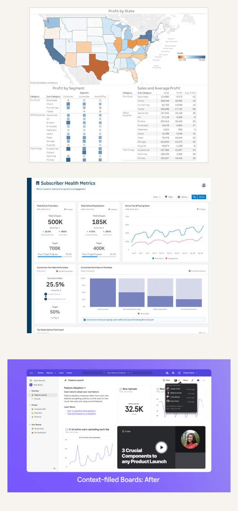
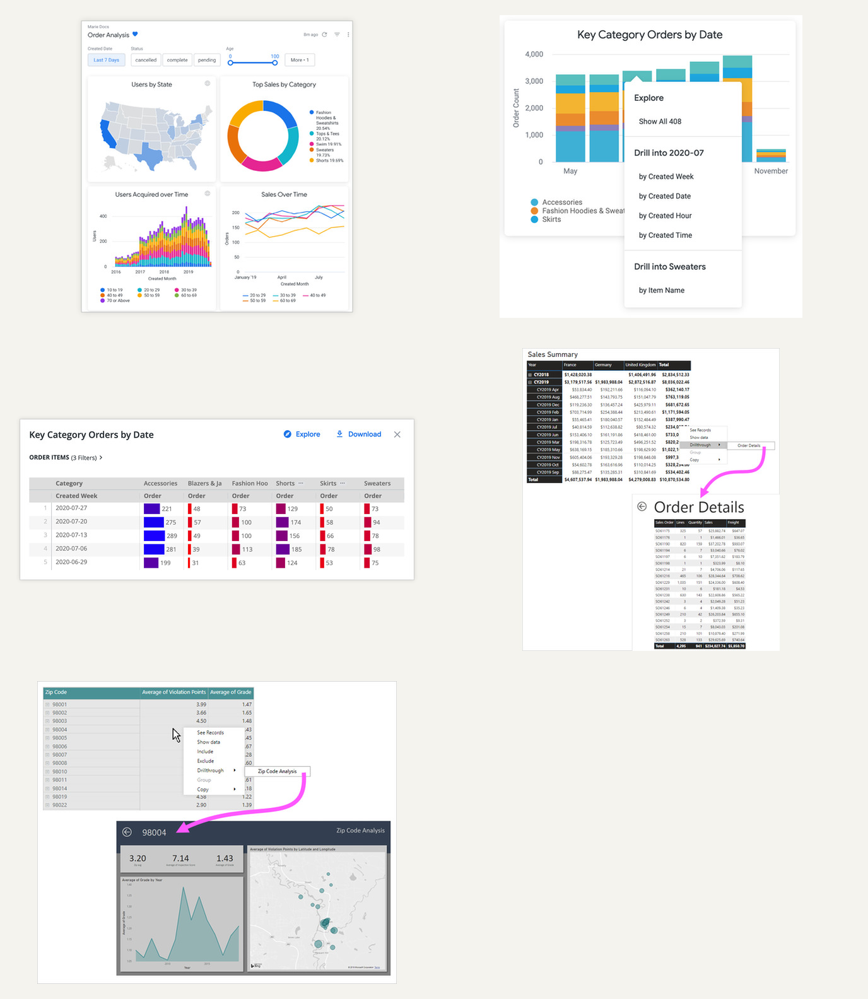
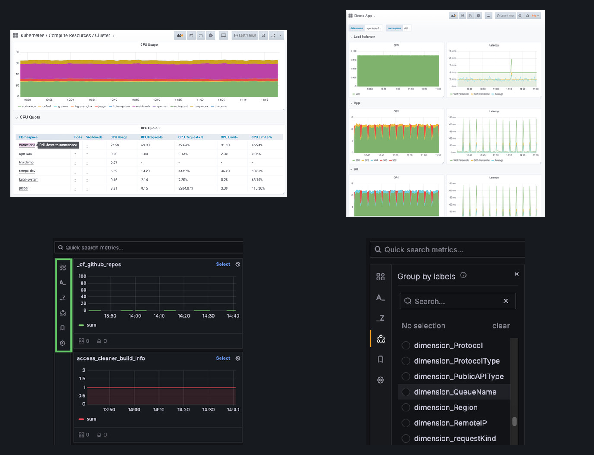

# Drilldown analytics dashboard evidence package

Captured 2026-08-21

Style follow-up captured 2026-08-22: [Dark mode with green identity](dark-green-style-guides.md)

Visualization follow-up captured 2026-08-22: [Adobe Spectrum analytics visualization pass](adobe-spectrum-visualization-pass.md)

## Executive conclusion

The strongest direction for T3Code is a signal atlas with explicit domain drilldown.

The entry page should synthesize a small set of consequential signals across project movement, throughput, reliability, capacity, and evidence quality. Every signal should answer four things without a click: what is happening, how it changed, whether it deserves attention, and what scope the number represents. A click should carry the selected scope into a denser domain page. The domain page can then open an investigation workspace or exact evidence.

This leads to a four-level information model:

1. Atlas for orientation and attention
2. Domain or project page for explanation
3. Investigation view for slicing and comparison
4. Evidence view for exact values, definitions, and limits

The current Work Atlas already has the bones of this hierarchy. The main opportunity is to let the atlas branch by signal family as well as by project. Source boards remain valuable, but source is an evidence concern. A person arriving with a reliability or capacity question should not need to choose a source before seeing an explanation.

## Dashboard types in the portfolio

| Type | Primary job | Typical density | Best drill behavior | Evidence reference |
| --- | --- | --- | --- | --- |
| Strategic scorecard | Communicate health, movement, and goal status | Low | Prepared domain page | Amplitude |
| Executive synthesis | Direct attention across several domains | Low | Signal card to explanation | Tableau and Amplitude |
| Tactical portfolio | Compare projects, products, or segments | Medium | Ranked row to entity page | Grafana and Power BI |
| Operational monitor | Detect abnormal state quickly | Medium | Alert or entity to diagnostics | Grafana |
| Analytical workspace | Test follow-up questions through filters and pivots | High | Queryless exploration | Grafana Metrics Drilldown and Looker |
| Drillthrough report | Move from aggregate to exact supporting detail | High | Prepared detail page or overlay | Power BI and Looker |
| Collaborative context board | Preserve interpretation, learning, and decisions beside metrics | Mixed | Analysis tile to report | Mixpanel |

These types should be composed as levels, not mixed indiscriminately on one page. The T3Code atlas is strategic and executive. Domain pages are tactical or operational. Investigation is analytical. Evidence is drillthrough detail.

## Visual portfolio

### Entry dashboard references

The three examples show different answers to the entry-page problem.

- Tableau uses one dominant geographic view with two subordinate exact-value views. The important lesson is hierarchy, not the map. The first glance has an obvious visual anchor.
- Amplitude combines current values, changes, goals, trends, and a funnel. This is the most relevant reference for a synthesized executive entry view.
- Mixpanel places explanatory text, learning material, and analysis on the same board. This is useful when the dashboard is also the place where a team records why a metric matters.

Sources: [Tableau dashboard best practices](https://help.tableau.com/current/pro/desktop/en-us/dashboards_best_practices.htm), [Amplitude executive reporting](https://amplitude.com/blog/monitor-digital-business-performance-executive-reporting-dashboards), [Mixpanel context-filled boards](https://mixpanel.com/blog/boards-collaborate-cards-mixpanel-feature-update/)

### Drilldown interaction references

Looker and Power BI expose two distinct interaction contracts.

- Looker keeps the user in context. A selected mark opens a menu with several valid drill paths, then a filtered overlay. This works when the next question is ambiguous and the user may want to inspect several cuts.
- Power BI uses full-page drillthrough. Its additional-depth example moves from a monthly summary to exact orders. Its broader-perspective example moves from a row to a new analytical composition. This works when the destination has a stable layout and deserves more space.

Sources: [Looker dashboard interaction guide](https://docs.cloud.google.com/looker/docs/viewing-dashboards?hl=en), [Power BI drillthrough guidance](https://learn.microsoft.com/en-us/power-bi/guidance/report-drillthrough)

### Operational drilldown references

Grafana demonstrates the operational pattern.

- A summary chart sits above a ranked table whose entity names are explicit drilldown links.
- A service page repeats a small diagnostic grammar across system layers. Request rate and latency are placed consistently, so the user can compare like with like.
- A dense investigation view exposes search, filters, label grouping, and repeated metric cards. This density is appropriate after the user has chosen to investigate. It would be too much for the entry atlas.

Sources: [Grafana dashboard best practices](https://grafana.com/docs/grafana/latest/visualizations/dashboards/build-dashboards/best-practices/), [Grafana Metrics Drilldown update](https://grafana.com/blog/whats-new-in-grafana-metrics-drilldown-advanced-filtering-options-ui-enhancements-and-more/)

## What good analytics presentation looks like

### Begin with a decision, not a dataset

A dashboard should have a purpose and a known audience. Tableau recommends defining the intended message or question before design. Grafana similarly says a dashboard should tell a story or answer a question. This is the strongest defense against metric sprawl.

For T3Code, the atlas question can be:

> What changed across the T3Code working system, what deserves attention, and where should I look next?

Every element on the entry page should earn its place by answering part of that question.

### Use progressive density

Density should increase with user intent.

- The atlas is sparse and interpretive.
- A domain page is comparative and explanatory.
- An investigation view is dense and interactive.
- An evidence view is exact and verbose.

The Nielsen Norman Group describes progressive disclosure as an initial dashboard that spotlights a few health signals, reveals more categories on interaction, and opens data-intensive graphs or grids only at the deepest level. The report is old, but the interaction principle remains directly relevant. [Nielsen Norman application design showcase](https://media.nngroup.com/media/reports/free/Application_Design_Showcase_1st_edition.pdf)

### Make the first glance interpretive

A naked value forces the reader to invent context. A useful signal card should contain:

- A plain-language signal label
- The current value or state
- Change against a named comparison
- A target, threshold, or expected range when one is legitimate
- One sentence explaining why the movement matters
- A clear drill destination
- Freshness and coverage when confidence is incomplete

The Amplitude example is strong because it pairs current values with short-term change, longer-term change, and goal progress. The weakness is that the page becomes long and metric-heavy. T3Code should borrow the card grammar without borrowing the full volume.

### Preserve context across every transition

Drilldown should behave like a refinement, not a reset. Carry forward:

- Time window
- Comparison window
- Selected project, domain, state, or model family
- Active filters
- Sort order when it remains meaningful
- The selected chart mark or table row

Show that carried context as removable chips and in the page title. Give the user a one-step return path. Microsoft explicitly frames drillthrough as a flow from summary, to selected visual element, to complementary analysis, and back to the source page. Grafana supports carrying time and template variables in dashboard links. [Power BI drillthrough guidance](https://learn.microsoft.com/en-us/power-bi/guidance/report-drillthrough), [Grafana link guidance](https://grafana.com/docs/grafana/latest/visualizations/dashboards/build-dashboards/manage-dashboard-links/)

### Match the transition to the analytical question

Use three interaction types deliberately.

#### Refine in place

Use for a quick filter, highlight, tooltip, or small detail overlay. The user is still answering the same question.

Examples include selecting one state on a map, one status in a chart, or one project in a ranked list. Looker shows a filtered drill overlay while retaining the originating chart context.

#### Navigate to a prepared page

Use when the next question is stable and needs a new composition.

Examples include reliability summary to reliability diagnostics, capacity pressure to model and context detail, or project portfolio to one project synthesis. Power BI demonstrates both additional depth and a broader perspective as valid destinations.

#### Enter investigation mode

Use when the user may pivot repeatedly and the route cannot be fully predicted.

Examples include grouping by model family, filtering runtime state, changing interval, comparing cohorts, or moving from a failed-turn trend to tool activity and capacity. Grafana Metrics Drilldown is the clearest reference for this queryless workspace.

Do not make every chart behave differently. A consistent click rule is easier to learn:

- Click a signal card to open its domain page
- Click a chart mark to refine the current scope
- Use a labeled Explore action to enter investigation mode
- Use View evidence to open exact supporting values

### Make trust visible

Analytics without provenance encourages false precision. Looker surfaces freshness and supports certified content. Tableau Data Guide adds descriptions, source details, applied filters, and detected outliers. T3Code has an even stronger need for visible analytical limits because missing values, partial coverage, and privacy exclusions are first-class parts of the contract.

Each page should expose:

- Data as of time
- Metric definition
- Grain and time semantics
- Denominator
- Coverage or missingness
- Source lineage
- Known caveats
- A direct evidence path

The atlas can compress these into freshness and confidence badges. The evidence page should show the full contract.

### Use visual channels conservatively

Use position and length for comparisons. Use exact text for values that must be read precisely. Use line charts for change over time, bars for ranked comparisons, small multiples for repeated system layers, and tables for exact records or many attributes.

Controlled graphical-perception research shows that decoding effectiveness changes with the chosen visual encoding, including spatial position, length, and area. This supports selecting encodings for the reading task rather than for novelty. Heer and Bostock replicated earlier spatial-encoding results and extended the evidence to area judgment, chart size, and gridline spacing. [Heer and Bostock graphical perception study](https://idl.uw.edu/papers/crowdsourcing-graphical-perception)

Color should carry meaning. Grafana recommends expressive color and normalized axes when comparing like systems. On the atlas, reserve strong color for attention state. Keep ordinary values neutral. Never rely on color alone.

Avoid pie and donut charts when the task is precise comparison. The Looker screenshot is useful evidence of interaction anatomy, but its donut is not a recommendation for T3Code.

### Control dashboard cost

More tiles create both cognitive and query cost. Tableau recommends limiting an entry dashboard to two or three views and spreading larger questions across connected views. It also warns that every sheet and interactive filter can add queries. T3Code does not need to follow the number literally, but it should follow the constraint: a small number of composed views on entry, then denser pages after intent is known. [Tableau performance guidance](https://help.tableau.com/current/pro/desktop/en-us/perf_visualization.htm)

### Design a nonvisual path

Every chart needs a text summary and a data-table alternative. Keyboard focus must follow the visual hierarchy. Selected state cannot depend on color alone. Tableau notes that mark interaction itself is not fully accessible, which is a useful warning against making chart clicks the only route. Every drill target should also exist as a labeled link or button. [Tableau accessibility guidance](https://help.tableau.com/current/pro/desktop/en-us/accessibility_dashboards.htm)

## Portfolio of architecture options

### Option A · Signal atlas with domain drilldown

Best fit for T3Code

The entry page has five to seven synthesized signals and one portfolio movement view. Signals branch to domain pages for projects, adoption, throughput, activity, capacity, reliability, delivery, and evidence quality.

Strengths:

- Matches the request for synthesis across many domains
- Lets each domain use the right analytical composition
- Keeps source mechanics downstream of the user question
- Scales without turning the atlas into a wall of charts

Risks:

- Synthesis rules need explicit semantics and ownership
- Poor signal labels can become vague editorial claims
- Domain navigation must remain visible or users can feel lost

Reference blend: Amplitude entry cards, Grafana hierarchy, Power BI prepared drillthrough, Looker evidence overlay.

### Option B · Scorecard with detail drawer

Best for the fastest usable release

The entry page is a compact grid of metrics. Selecting one opens a wide side drawer with trend, breakdown, definition, and evidence links. The user can inspect several metrics without leaving the atlas.

Strengths:

- Fast transitions
- Easy comparison across cards
- Lower routing and page-composition cost
- Strong for brief inspection

Risks:

- Drawers become cramped when analysis grows
- Browser history and shareable state need deliberate support
- It can blur the boundary between summary and investigation

Reference blend: Looker drill overlay and Amplitude scorecards.

### Option C · Question hub to investigation workspace

Best for expert self-service

The entry page presents questions such as where reliability changed or which model family is creating capacity pressure. Selecting a question opens a dense workspace with filter rail, group-by controls, repeated plots, and saved views.

Strengths:

- Encourages analytical thinking rather than metric browsing
- Flexible for unforeseen follow-up questions
- Powerful for operators and analysts

Risks:

- Higher implementation and learning cost
- Easy to expose unsafe or semantically invalid dimensions
- Requires strong defaults and query guardrails

Reference blend: Grafana Metrics Drilldown and Looker Explore.

### Option D · Entity matrix to prepared detail pages

Best for portfolio operations

The entry page centers a ranked project matrix. Columns show recency, work share, completion state, reliability, capacity pressure, and evidence confidence. Selecting a row opens one project page with the same domain grammar.

Strengths:

- Excellent scanning across many projects
- Makes outliers and uneven coverage visible
- Repeated detail pages are predictable

Risks:

- Less effective for cross-project system signals
- Tables can invite unsupported comparison or productivity inference
- Requires careful privacy-safe thresholds and suppression

Reference blend: Grafana linked tables and Power BI row drillthrough.

### Option E · Context board with narrative drilldown

Best for collaborative reviews

The entry board combines signal cards, written interpretation, decisions, experiment notes, and links to deeper analyses. It acts as a shared analytical briefing rather than a pure monitor.

Strengths:

- Preserves why a metric is being watched
- Supports review meetings and asynchronous interpretation
- Can connect analysis to decisions without inventing causality

Risks:

- Commentary can become stale before data does
- Ownership and revision history become necessary
- Narrative can overstate what the data proves

Reference blend: Mixpanel Boards and Tableau Data Guide.

## Recommended T3Code composition

### Atlas

Use a stable page skeleton.

1. Scope bar with rolling window, comparison, freshness, and evidence confidence
2. Attention strip with only signals that crossed an accepted condition
3. Five domain cards for portfolio movement, throughput, reliability, capacity, and evidence readiness
4. One 42-day composition chart with direct project drilldown
5. Compact project navigator with explicit search and recency filter

Each domain card should have a specific destination. A reliability card should never open a generic source board.

### Domain page

Use one question per page and a repeated grammar.

1. Current reading in plain language
2. Two to four key measures with comparison
3. Primary trend with event or state annotations
4. Ranked breakdown that explains contribution
5. Distribution view when averages can hide tails
6. Explore and View evidence actions

### Investigation workspace

Expose only approved dimensions. Begin with carried context and safe defaults. Provide reversible filters, group-by controls, comparison, a visible query summary, and a way to save or share the exact state.

### Evidence view

Show exact admitted facts and analytical contracts. Keep this view visually quiet and table-forward. It should be possible to move from every elevated claim to its definition, denominator, coverage, source, and caveat.

## Example T3Code drill paths

### Reliability

Atlas reliability signal → reliability domain → error trend by runtime mode → selected spike → activity families and turn states → admitted evidence

### Capacity

Atlas capacity signal → capacity domain → peak context utilization distribution → model family comparison → selected high-pressure band → compaction and runtime detail → admitted evidence

### Project movement

Atlas portfolio signal → ranked project view → one project synthesis → selected time window → source board → admitted evidence

### Data confidence

Atlas evidence-readiness signal → coverage domain → missingness by metric family → one metric contract → source lineage and caveats

## Anti-patterns to avoid

- A home page that reproduces every domain dashboard at miniature scale
- KPI cards with no comparison, denominator, or scope
- Hidden drill behavior that only appears on hover
- Right-click as the only access path
- A back action that loses time and filters
- Global filters that silently change unrelated metrics
- Tables where zero and missing are visually identical
- Color used as decoration across many categories
- Synthetic narratives that imply causality or productivity
- Raw record drillthrough that violates the T3Code topology boundary

## Evidence quality and limitations

The screenshots are official vendor-provided product or documentation images. They demonstrate real interface patterns and documented interaction contracts. They do not prove that the designs performed better in an independent usability study. Marketing images may show idealized data and may omit failure states, loading behavior, accessibility behavior, and mobile constraints.

The recommendations therefore rely on convergence across sources, fit with the accepted T3Code metric and privacy contracts, and clear separation between monitoring, explanation, investigation, and evidence.

Asset provenance, capture dates, direct image URLs, dimensions, and hashes are recorded in [sources.yaml](sources.yaml).
